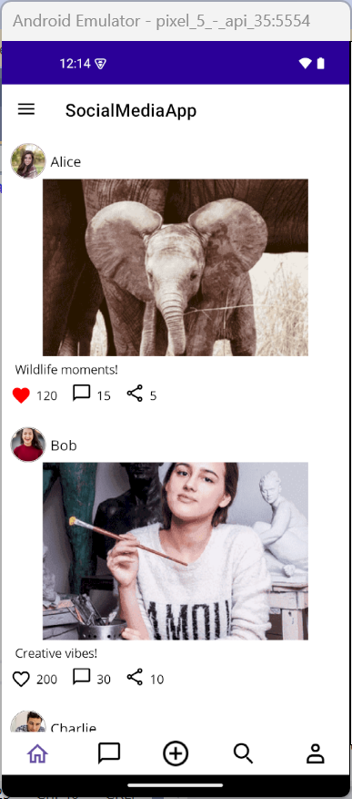
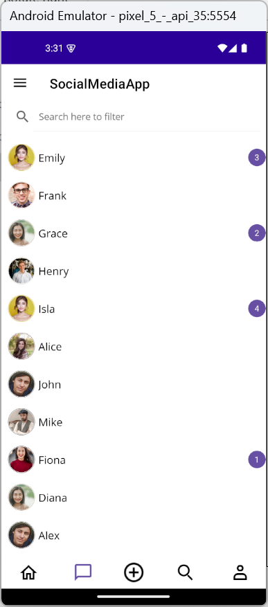
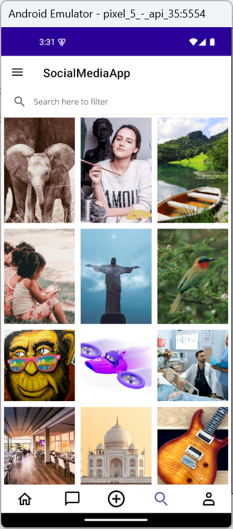
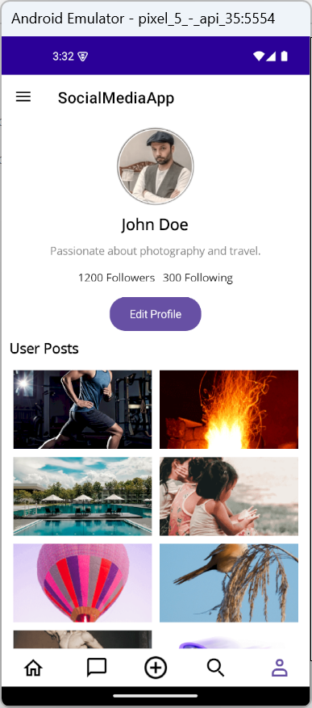

# Designing a User-Friendly Social Media App with Post Sharing in .NET MAUI

## Introduction
In modern social media apps, intuitive navigation is key to user engagement. A Tab View with a Center Button offers users a seamless way to switch between app sections while providing quick access to essential actions-like creating a new post.
In this tutorial, we'll build a social media app using Syncfusion's .NET MAUI Tab View and List View, featuring:
Home Tab - Personalized feed with posts.
* Messages Tab - Recent chats and notifications.
* Explore Tab - Trending and suggested content.
* Profile Tab - User profile and posts.
* Center Button - Quick access to post creation.

## Step-by-Step Implementation

### Step 1: Install Syncfusion MAUI Tab View
Begin by installing and configuring the Syncfusion .NET MAUI Tab View. Follow the official [documentation](https://help.syncfusion.com/maui-toolkit/tabview/getting-started) to set it up in your project.
This control allows you to create a tabbed interface with customizable tabs and a center button.

### Step 2: Define Data Models
Data models represent the structure of your app's content. In this case, you'll need models for posts and messages.

### Step 3: Create the ViewModel
The SocialMediaViewModel acts as the data context for your views. It holds collections of posts and messages, which are bound to the UI using data binding.

### Step 4: Design the Tab View Layout
In this step, we'll set up the main navigation layout using SfTabView from Syncfusion. This layout includes:
* A bottom tab bar with four tabs: Home, Messages, Explore, and Profile.
* A center button for quick access to post creation.
* Custom tab header styling using VisualStateManager to highlight the selected tab.

### Step 5: Add Content for Each Tab
Each tab in your social media app serves a unique purpose. To display dynamic content, we'll use Syncfusion's SfListView, a powerful and customizable list control for .NET MAUI.
Before using SfListView, make sure to install and configure it by following the official documentation.
First, bind your SocialMediaViewModel to the page. This ensures that all tabs can access the data collections (Posts, Messages, ExplorePosts, UserPosts) defined in the ViewModel.

